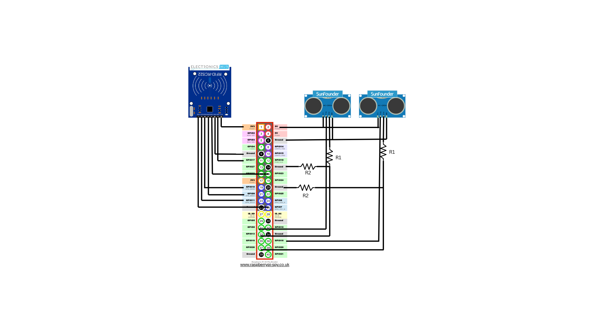
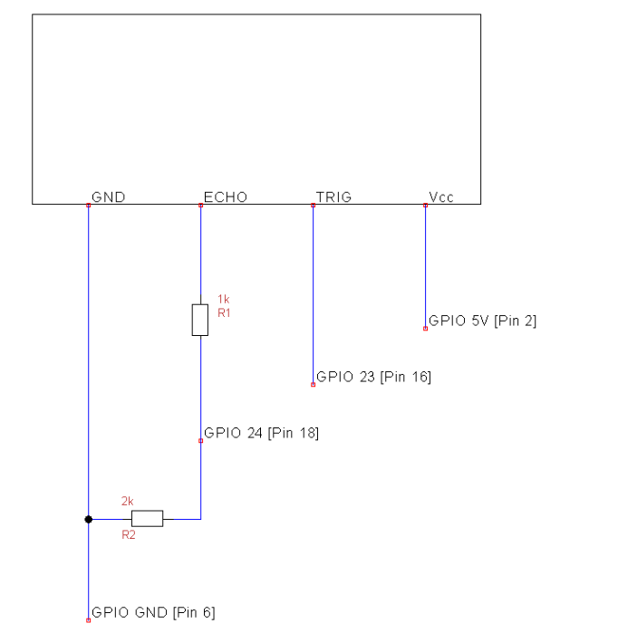

# System Overview

This is the README for the entry gate system. This system consists of an RFID reader before the gate to verify the car and an ultrasonic sensor after the gate to verify the car actually entered. In addition, the entry system has the ultrasonic sensor for the exit gate since it would not work on the other Raspberry Pi.

## How the Entry System Works
When an RFID tag is sensed, the system will send the UID to the cloud system. The cloud system will determine if the car can enter or not and send the decision back. If the car cannot enter, nothing will happen. If the car can enter, the system will send an MQTT message to the entry gate to open. The ultrasonic sensor waits for the car to enter its field of view for at least a specified length of time and then leave its view for at least that same amount. If this happens, the entry system will send the UID to the cloud system via MQTT telling it that the car entered succesffully. If the car does not successfully enter, the entry system will reset the gate and the car is considered as not having entered.

The system also logs and outputs everything that is happening to the screen.

A car cannot enter if *any* of the following apply:
- The parking lot is full
- The car entered the parking lot but did not leave

# Wiring

The sensors should be attached to the pi according to the following diagram. Details follow in sections below.



## RFID Sesnors

RFID 2 was placed on the exit Pi for technical reasons.

| RC522 Pin | RFID 1 | RFID 2| Raspberry Pi Pin  |
|-----------|----------|----------|-------------------|
| SDA (CS/SS) | GPIO 7  | GPIO 8 | Chip Select (CS)  |
| SCK (CLK)   | Shared  | Shared  | GPIO 11           |
| MOSI        | Shared  | Shared  | GPIO 10           |
| MISO        | Shared  | Shared  | GPIO 9            |
| IRQ         | GPIO 23 | GPIO 24 | Interrupt Pin     |
| RST         | GPIO 17 | GPIO 27 | Reset Pin         |
| GND         | Shared  | Shared  | GND               |
| 3.3V        | Shared  | Shared  | 3.3V              |


## Ultrasonic Sensors

| Sensor Pin | Sensor 1 | Sensor 2 | Raspberry Pi Pin     |
|------------|----------|----------|----------------------|
| Trigger    | GPIO 6   | GPIO 16  | Start Sensing Pin    |
| Echo       | GPIO 13  | GPIO 26  | Receive Echo Pin     |
| GND        | Shared   | Shared   | GND                  |
| 5V         | Shared   | Shared   | 5V                   |

### Voltage Conversion for Ultrasonic Sensors to RPi

The pins on the RPi are only 3.3V, but the echo pin outputs 5V, so there needs to be a voltage divider, as seen in the picture below:


From: https://thepihut.com/blogs/raspberry-pi-tutorials/hc-sr04-ultrasonic-range-sensor-on-the-raspberry-pi

The resistor values used are as follows:

| Unit | Resistor | Value   | Connection        |
|------|----------|---------|-------------------|
| US 1 | R2       | 1K      | To ground         |
|      | R1       | 470 Ohm | To sensor         |
| US 2 | R2       | 2.2k    | To ground         |
|      | R1       | 1k      | To sensor         |


# Setup

## Install Dependencies
In a terminal, run

```
sudo apt update && sudo apt upgrade -y
sudo apt install python3-pip python3-rpi.gpio python3-spidev -y
pip3 install RPi.GPIO spidev pi-rc522 gpiozero pigpio

sudo apt install pigpio python3-pigpio
sudo systemctl enable pigpiod
sudo systemctl start pigpiod
```

# Enable SPI

In a terminal, run
```
sudo raspi-config
```

Go to Interface Options → SPI → Enable

Now reboot your Pi. In a terminal, run
```
sudo reboot
```

# Running the Code

Before running, in ```sensor_system_entry.py``` change the broker ip to the correct MQTT broker instance.

Then run the following command to start the entry system:
```
python3 sensor_system_entry.py entry
```

The `entry` argument tells the system that this is an entry gate, since the same code is used for the entry and exit gate systems.

# Output

## Screen
The system will log and output to the screen everything that is happening

## Mechanical
The system itself does not output any movement, but it does tell the entry gate to open/close

